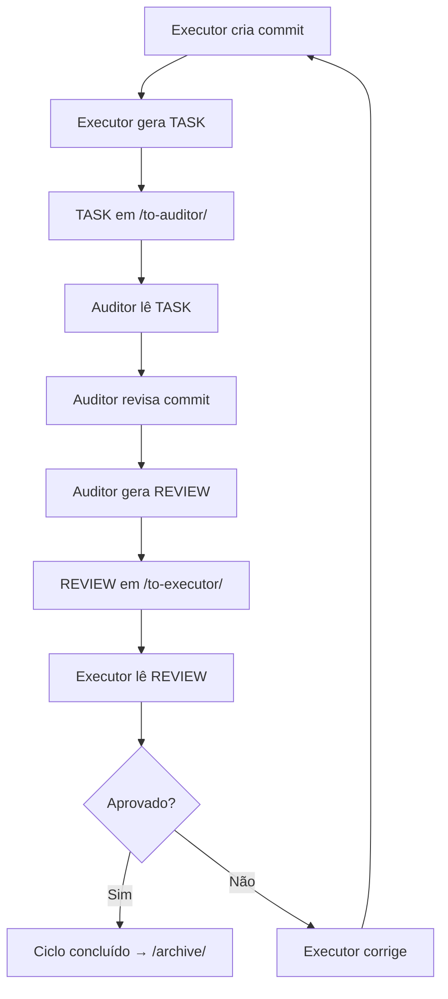

# AI-Bridge — Protocolo de Comunicação entre Agentes

## 1. Finalidade

A pasta `ai-bridge` é o canal estruturado de comunicação entre duas IAs que operam neste repositório:

- **Executor (Antigravity):** implementa mudanças, corrige erros, estabiliza o sistema.
- **Auditor (GitHub

 AI / Copilot):** revisa mudanças, identifica riscos, emite revisões técnicas.

O objetivo é garantir que todo desenvolvimento guiado por IA ocorra com **controle**, **rastreabilidade** e **ciclos claros de correção**.

---

## 2. Papéis dos Agentes

### Executor (Antigravity)

- Implementa mudanças no código
- Gera TASKs após cada mudança significativa
- Lê REVIEWs e executa correções
- Nunca ignora o ciclo de auditoria

### Auditor (GitHub AI / Copilot)

- Lê TASKs enviadas pelo executor
- Verifica o diff real do commit
- Compara intenção com implementação
- Gera REVIEWs estruturados
- **Nunca altera código diretamente**

---

## 3. Estrutura de Pastas

```
/ai-bridge/
├── to-auditor/       ← TASKs do executor para o auditor
├── to-executor/      ← REVIEWs do auditor para o executor
├── state/            ← Estado do ciclo atual
├── archive/          ← Histórico de ciclos concluídos
│   └── YYYY-MM/      ← Organizado por mês
├── schemas/          ← Schemas JSON de validação
├── templates/        ← Templates de TASK e REVIEW
└── docs/             ← Documentação do protocolo
```

---

## 4. Fluxo de Comunicação



### Passo a passo

1. Executor cria commit com mudanças
2. Executor cria TASK em `/ai-bridge/to-auditor/TASK-YYYYMMDD-###.json`
3. Executor atualiza `state/CURRENT_TASK.json` com `next_owner: "auditor"`
4. Auditor lê a TASK
5. Auditor revisa o diff do commit
6. Auditor cria REVIEW em `/ai-bridge/to-executor/REVIEW-YYYYMMDD-###.json`
7. Auditor atualiza `state/CURRENT_TASK.json` com `next_owner: "executor"`
8. Executor lê o REVIEW
9. Se aprovado → mover arquivos para `/archive/YYYY-MM/`
10. Se rejeitado → executor corrige e gera nova TASK

---

## 5. Formato de IDs

| Tipo   | Formato               | Exemplo             |
|--------|----------------------|---------------------|
| TASK   | `TASK-YYYYMMDD-###`   | `TASK-20260314-001` |
| REVIEW | `REVIEW-YYYYMMDD-###` | `REVIEW-20260314-001` |

---

## 6. Regras de Versionamento

- **Nunca sobrescrever** arquivos anteriores
- **Sempre criar novos** arquivos com IDs incrementais
- Cada TASK e REVIEW é **imutável** após criação
- O estado atual é controlado por `state/CURRENT_TASK.json`

---

## 7. Regras de Arquivamento

Ciclos concluídos (TASK aprovada) devem ser movidos para:

```
/ai-bridge/archive/YYYY-MM/
```

Exemplo:

```
/ai-bridge/archive/2026-03/
├── TASK-20260314-001.json
└── REVIEW-20260314-001.json
```

O arquivo `state/CURRENT_TASK.json` deve ser resetado após o arquivamento.

---

## 8. Validação Mínima por Ciclo

Antes de enviar qualquer TASK, o executor deve validar:

- ✅ Build
- ✅ Typecheck
- ✅ Lint
- ✅ Fluxo funcional afetado

---

## 9. Critérios de Qualidade

A infraestrutura deve ser:

- **Clara** — qualquer agente entende o protocolo
- **Auditável** — todo ciclo é rastreável
- **Extensível** — novos campos podem ser adicionados aos schemas
- **Simples** — sem complexidade desnecessária
- **Sem ambiguidade** — regras explícitas para cada situação
